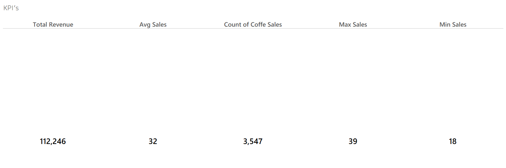
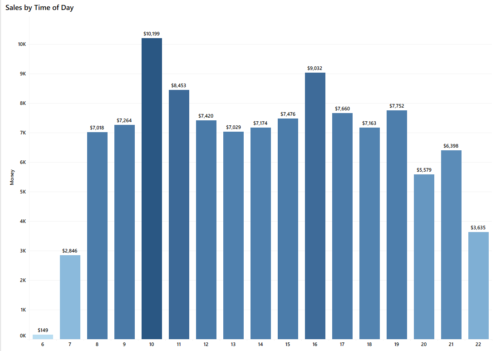
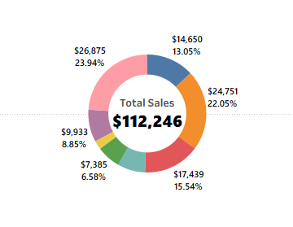
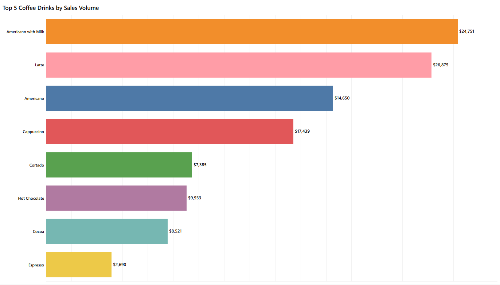
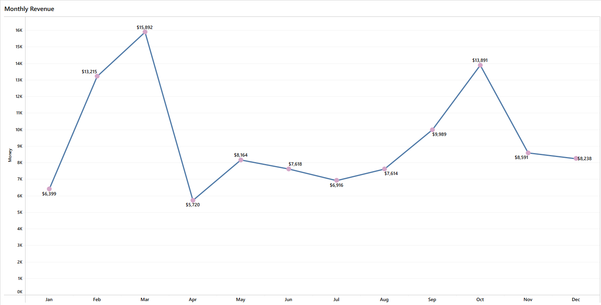
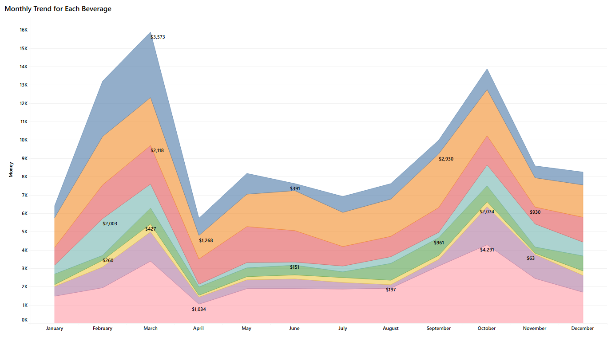
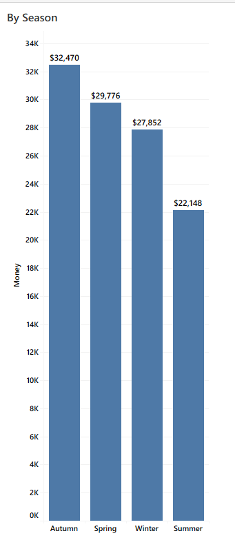
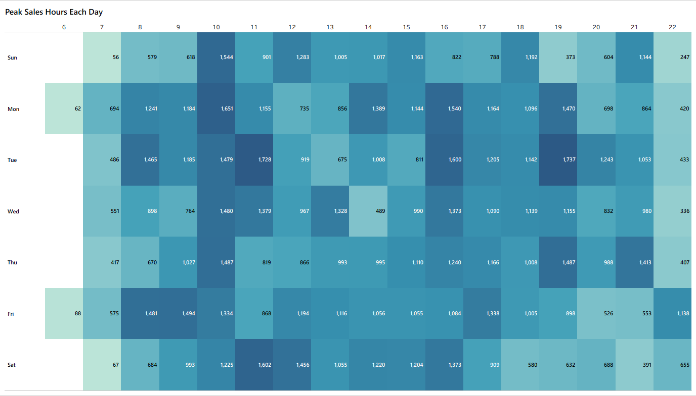

# Coffee Sales Analysis Dashboard ☕

## 📌 Project
Pet project based on the **Kaggle Coffee Sales Dataset**.  
Goal: analyze coffee sales data, identify patterns in customer behavior, seasonal trends, peak hours, and popular beverages.

**Tools:** Tableau (dashboard), CSV dataset (Kaggle)

---

## 🛠️ Visualizations

### 1. KPI’s
Key metrics displayed:  
- Total Revenue  
- Average Sales  
- Count of Coffee Sales  
- Max Sales  
- Min Sales  

---

### 2. Sales by Time of Day
Shows sales trends throughout the day (hours).

---

### 3. Share of Each Beverage in Revenue
Bar chart showing the contribution of each beverage to total revenue (absolute and percentage).

---

### 4. Top 5 Coffee Drinks by Sales Volume
Displays the most popular coffee drinks.

---

### 5. Monthly Revenue
Shows total revenue per month.

---

### 6. Monthly Trend for Each Beverage
Area chart showing trends for each beverage with min/max revenue per period.

---

### 7. By Season
Total sales per season (Winter, Spring, Summer, Autumn).

---

### 8. Peak Sales Hours Each Day
Heatmap: Hour of Day × Weekday → shows peak sales hours.

---

### 9. Filters
Interactive filters added:  
- Date  
- Month Name  
- Season  
- Coffee Name

---

## 🔎 Insights

- **Most popular beverages:** Americano with milk, Latte, Americano.  
- **Seasonality:**
  - Winter → higher demand for Americano with milk, Latte, Americano.  
  - Summer → Americano with milk, Latte, Cappuccino.  
  - Autumn → similar to Winter, demand remains stable.  
- **Sales by hours:**
  - Morning peak: 8–10 AM; secondary peak around 4 PM.  
  - Spring → good sales from 10 AM to 7 PM.  
  - Summer → two peaks: 8–12 AM and 7–9 PM (highest at 9 PM due to longer daylight).  
- **Payment method:** Card only (no cash).  
- **Daily sales stability:** After 10 AM, sales remain relatively stable, but seasonal differences are visible.  

**Additional insights:**  
- Top beverages generate the majority of revenue → marketing should focus on these items.  
- Summer evening peak suggests potential for seasonal cold drinks.  
- Seasonal beverage trends are mostly consistent, but time-of-day patterns vary.

---

## 📈 Dashboard
👉 Tableau Public Link: https://public.tableau.com/views/CoffeSales_17584052732210/Top5CoffeeDrinksbySalesVolume?:language=en-US&publish=yes&:sid=&:redirect=auth&:display_count=n&:origin=viz_share_link

## 📂 Data
- Dataset: Kaggle Coffee Sales: https://www.kaggle.com/datasets/navjotkaushal/coffee-sales-dataset  
- Format: CSV

---

## ✅ Conclusion
The analysis shows clear patterns in time-of-day and seasonal coffee sales.  
Findings can help:  
- plan staff schedules based on peak hours,  
- optimize coffee stock and inventory,  
- promote seasonal products (summer evenings, winter hot drinks).
